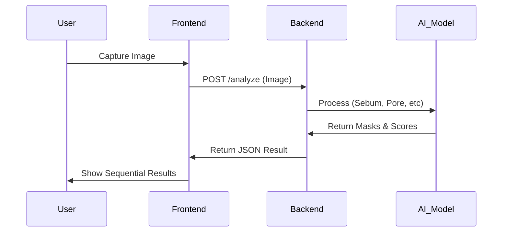
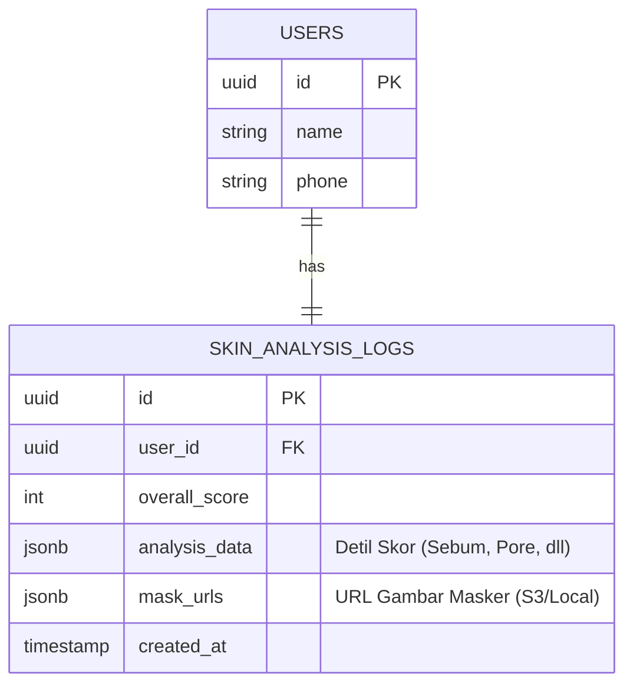

# Skin Analysis Microservice Documentation

## 1. System Flow (To The Point)

**User Flow:**
1. **Registrasi** → **ToS** → **Kamera** (Validasi Wajah)
2. **Auto-Capture** → Kirim ke Backend API
3. **Backend Processing** (AI Analisis 6 Kondisi)
4. **Frontend Visualization** (Slider Hasil 1-6) → **Bitmoji Report**

**Data Flow:**


## 2. ERD (Proposed Data Structure)

Meskipun service ini *stateless* (hanya proses), hasil analisis perlu disimpan di database utama saat finalisasi registrasi.



## 3. Tech Stack
- **Backend**: Python (FastAPI), OpenCV, NumPy.
- **Frontend**: React, Webcam, Canvas (untuk slider).
- **Deployment**: Docker Container.

---

## 5. Cara Menjalankan

### Development (Manual)

**Backend:**
```bash
cd skin-analysis-service
pip install -r requirements.txt
uvicorn main:app --host 0.0.0.0 --port 8001 --reload
```

**Frontend:**
```bash
cd frontend-components
npm install
npm run dev
```

Akses:
- Frontend: http://localhost:3000
- Backend API: http://localhost:8001
- API Docs: http://localhost:8001/docs

### Production dengan Docker

**Backend Only:**
```bash
# Build image
docker build -t oriskin-backend .

# Run container
docker run -p 8001:8001 oriskin-backend
```

**Dengan Docker Compose (Recommended):**
```bash
# Jalankan semua services
docker-compose up -d

# Lihat logs
docker-compose logs -f

# Stop services
docker-compose down
```

**Build ulang setelah perubahan kode:**
```bash
docker-compose up -d --build
```

---

## 4. Current Status (Mock vs Real)

| Komponen | Status | Keterangan |
|----------|--------|------------|
| **API Endpoints** | **Real** | Struktur request/response sudah production-ready. |
| **AI Logic** | **Mock** ⚠️ | Menggunakan `random` score dan `dummy circles` untuk mask. |
| **Camera UI** | **Real** | Bisa capture foto dari webcam asli. |
| **Face Validasi** | **Mock** ⚠️ | Simulasi "checking" (timer 3 detik), belum connect MediaPipe. |
